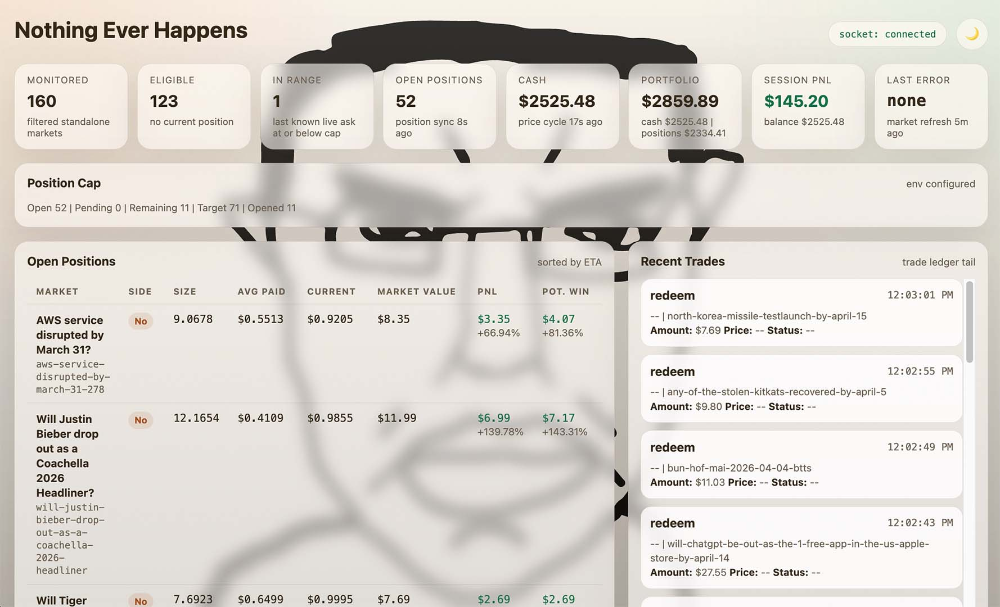

# Always Say Yes Polymarket Bot

Focused async Python bot for Polymarket that buys Yes on standalone non-sports yes/no markets and holds to resolution.

*FOR ENTERTAINMENT ONLY. PROVIDED AS IS, WITHOUT WARRANTY OF ANY KIND, EXPRESS OR IMPLIED. USE AT YOUR OWN RISK. THE AUTHORS ARE NOT LIABLE FOR ANY CLAIMS, LOSSES, OR DAMAGES.*



- `bot/`: runtime, exchange clients, dashboard, recovery, and the `anything_can_happen` strategy implementation now configured for the Always Say Yes thesis
- `scripts/`: operational helpers for deployed instances and local inspection
- `tests/`: focused unit and regression coverage

## Runtime

The bot scans standalone markets, looks for YES entries below a configured price cap, tracks open positions, exposes a dashboard, and persists live recovery state when order transmission is enabled.

The runtime identifier is `anything_can_happen`.

## Safety Model

Real order transmission requires all three environment variables:

- `BOT_MODE=live`
- `LIVE_TRADING_ENABLED=true`
- `DRY_RUN=false`

If any of those are missing, the bot uses `PaperExchangeClient`.

Additional live-mode requirements:

- `PRIVATE_KEY`
- `FUNDER_ADDRESS` for signature types `1` and `2`
- `DATABASE_URL`
- `POLYGON_RPC_URL` for proxy-wallet approvals and redemption

## Setup

```bash
pip install -r requirements.txt
cp config.example.json config.json
cp .env.example .env
```

`config.json` is intentionally local and ignored by git.

## Configuration

The runtime reads:

- `config.json` for non-secret runtime settings
- `.env` for secrets and runtime flags

The runtime config lives under `strategies.anything_can_happen`. `max_entry_price` is the maximum YES ask the bot will pay. See [config.example.json](config.example.json) and [.env.example](.env.example).

You can point the runtime at a different config file with `CONFIG_PATH=/path/to/config.json`.

## Running Locally

```bash
python -m bot.main
```

The dashboard binds `$PORT` or `DASHBOARD_PORT` when one is set.

## Heroku Workflow

The shell helpers use either an explicit app name argument or `HEROKU_APP_NAME`.

```bash
export HEROKU_APP_NAME=<your-app>
./alive.sh
./logs.sh
./live_enabled.sh
./live_disabled.sh
./kill.sh
```

Generic deployment flow:

```bash
heroku config:set BOT_MODE=live DRY_RUN=false LIVE_TRADING_ENABLED=true -a "$HEROKU_APP_NAME"
heroku config:set PRIVATE_KEY=<key> FUNDER_ADDRESS=<addr> POLYGON_RPC_URL=<url> DATABASE_URL=<url> -a "$HEROKU_APP_NAME"
git push heroku <branch>:main
heroku ps:scale web=1 worker=0 -a "$HEROKU_APP_NAME"
```

Only run the `web` dyno. The `worker` entry exists only to fail fast if it is started accidentally.

## Tests

```bash
python -m pytest -q
```

## Included Scripts

| Script | Purpose |
| --- | --- |
| `scripts/db_stats.py` | Inspect live database table counts and recent activity |
| `scripts/export_db.py` | Export live tables from `DATABASE_URL` or a Heroku app |
| `scripts/wallet_history.py` | Pull positions, trades, and balances for the configured wallet |
| `scripts/parse_logs.py` | Convert Heroku JSON logs into readable terminal or HTML output |

## Repository Hygiene

Local config, ledgers, exports, reports, and deployment artifacts are ignored by default.
# Anything-can-happen
